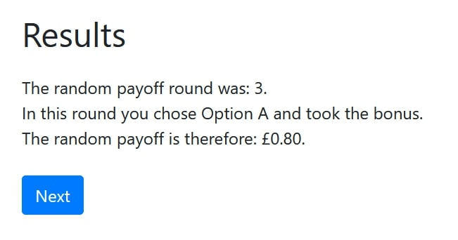

.. raw:: pdf

    PageBreak

.. _pages:

Pages
=======

Overview of all pages of the Carbon Emission Task

.. note::
    **Timeouts:** There is a timeout on every page of the experiment to account for dropped out players.
    In case a player begins the experiment and leaves, the player is automatically progressed through the
    rest of the experiment.

Instruction Page
-------------------
The following instructions are presented to the player:

Timeout
~~~~~~~~~~~~~~
There is a Timeout of 120 seconds on this page.

.. _practice_page_ref:

Practice Pages
---------------

There is a total of three practice pages before the actual CET starts. The practice pages don't visibly differ from
the actual experiment pages and serve the sole purpose of familiarising the participants with the task.
The following ``carbon``, ``car_miles``, ``bonus`` values are used in this order for the three practice pages:

 - 0.23 lbs. CO2, 0.37 car miles, 0.2£
 - 4.46 lbs. CO2, 7.24 car miles, 0.6£
 - 19.85 lbs. CO2, 32.22 car miles, 1£

These values can be changed in the following code block of the corresponding practice page class:

.. code-block:: python

    def vars_for_template(self):
        return dict(
            practice1_carbon=0.23,
            practice1_carmiles=0.37,
            practice1_bonus=0.2
        )

These values should match an existing combination of carbon, car miles and bonus values provided in the :ref:`csv_file`.
No data is logged for the practice pages.

Forms:
~~~~~~~~~~
The following forms are used for the practice page class:
The ``choice_practice`` field is needed to produce an error if a player clicks the "Next" Button before choosing an Option.

.. code-block:: python

    class Experiment_page(Page):
        form_model = 'player'
        form_fields = ['choice_practice']  # == player.choice_practice

Timeout:
~~~~~~~~~~
The timeout for practice pages is set to 20 seconds.

.. _exp_page:

Experiment Page
----------------

The experiment page class is responsible for the experimental rounds of the CET.

Forms
~~~~~~~~
The following forms are used for the experiment page class:
If a player presses either Option A or B the choice is automatically logged in the ``player.choice`` field.

.. code-block:: python

    class Experiment_page(Page):
        form_model = 'player'
        form_fields = ['choice']  # == player.choice

.. _timeout_ref:

Timeout
~~~~~~~~~~
In contrast to the Practice Pages' timeout, the timeout for experiment pages is set dynamically.
Before the timeout is set, it is checked whether or not the player has dropped out of the experiment. See :ref:`is_dropout_ref`

 - If ``player.is_dropout = True``, the player has dropped out and the timeout is set to 0. All subsequent pages
   are submitted instantly and the player is automatically progressed through the rest of the experiment.
 - Else the timeout is set to 20 seconds.

Before_next_page()
~~~~~~~~~~~~~~~~~~~~
The code below is executed once a player hits the "Next" button of a given round. The order of the code below is
very important because some functions depend on results that are calculated in previous functions. This order
must not be changed unless you absolutely know what you are doing.

.. code-block:: python

    def before_next_page(self):
        # Timeout check
        if self.timeout_happened:
            self.player.decided = False
            self.player.choice = 0
        else:
            self.player.decided = True

        #Payoff functions:
        self.player.set_payoff_per_round()
        self.player.set_payoff()

        #Emission functions:
        self.player.set_chosen_emission()
        self.player.set_total_emission()
        self.player.set_saved_emission()

        #Bot check
        self.player.set_is_bot()

        #Last round check
        if self.round_number == Constants.num_rounds:
            self.subsession.set_sum_saved_emission()

        # Helpful prints
        self.subsession.helpful_prints()

**Sequence of events (basic):**
 | 1. Timeout check
 |  - If a timeout happened the ``player.decided`` field is set to ``False`` and ``player.choice`` is set to 0 (Option B).
 |  - Else the ``player.decided`` field is set to ``True``.
 | 2. Payoff functions
 |  - ``set_payoff()`` depends on ``set_payoff_per_round()``.
 | 3. The emission functions are called.
 |  - ``set_chosen_emission()`` and ``set_saved_emission()`` depend on the ``player.choice`` field that is set in step 1.
 |  - ``set_saved_emssion()`` depends on ``set_total_emission`` and ``set_chosen_emission()``.
 | 4. Bot check
 |  - ``set_is_bot()`` is called and evaluates whether the player is a bot and/or a dropout.
 |  - This function depends on the ``player.decided`` field that is set in step 1.
 | 5. Last round check
 |  - If a player is in the last round of the CET, ``set_sum_saved_emission()`` is called.
 |  - This function depends on ``player.choice`` (step 1), ``set_saved_emision()`` (step 3) and ``set_is_bot()`` (step 4).
 | 6. Helpful prints
 |  - The helpful print functions is called and the state of most player and subsession fields are printed to the terminal.
 |  - This function depends on most of the above steps.

.. _results:

Results Page
--------------

The results page is displayed after the player has finished all rounds of the CET. The pages looks different
depending on the :ref:`random_payoff` constant and the Player's :ref:`choice_ref` in the paying round.
From left to right: ``random_payoff = True`` and player chose Option A; ``random_payoff = True`` and player chose Option B;
``random_payoff = False`` so the total payoff is shown.

|ran_a| |ran_b| |no_ran|

Timeout
~~~~~~~~~~
The timeout logic works the same way as in the experiment pages.
 - If a player has dropped out: Timeout = 0 seconds
 - Else: Timeout = 60 seconds

Before_next_page()
~~~~~~~~~~~~~~~~~~~~
This code is executed once the player hits the "Next" button of the results page. The code below is used to send
the mail for carbon-emission certificate purchases.

.. code-block:: python

    def before_next_page(self):
        #Is Finished fields and functions
        self.player.is_finished = True
        self.subsession.set_all_players_finished()

        # Helpful prints
        self.subsession.helpful_prints()

        # All finished check and send mail
        if self.subsession.all_players_finished:
            self.subsession.send_payment_mail(self.subsession.sum_saved_emission,
                                              "lbs",
                                              "Carbon Emission Task",
                                              "John Doe",
                                              "john.doe@cet.com")

**Sequence of events:**
 1. Once a player hits the "Next" button the ``is_finished`` field of the player is set to ``True``
 2. The ``set_all_players_finished()`` function checks if every player has finished the CET.
 3. Helpful information is printed to the terminal (including the number of players that have finished the CET).
 4. If all players have finished the CET, the ``send_payment_mail()`` function is called.

**Mail parameters:**
 - The :ref:`sum_saved_emission_ref` field is the total weight of CO2 emission that was saved by participants.
 - The unit of the weight is lbs.
 - The name of the experiment is Carbon Emission Task.
 - The name of the recipient is John Doe.
 - the recipient's email address is john.doe@cet.com. (Multiple addresses have to be specified in a list
   e.g. ["john.doe@cet.com", "jane.doe@cet.com"].

Contents of send_payment_mail():
~~~~~~~~~~~~~~~~~~~~~~~~~~~~~~~~~~~~
This is an example of a generated email:

The link directs you to the donation form, where the carbon-emission certificate purchase can be made.
The donation form looks like this:

